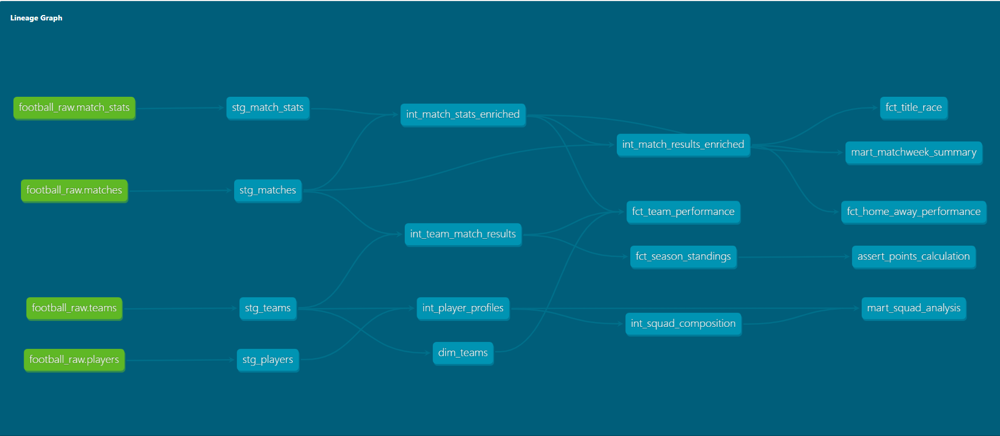

# ⚽ Premier League Analytics — End-to-End Data Engineering Pipeline

> A production-grade analytics pipeline built on synthetic Premier League 2023/24 data.  
> Raw match events flow through AWS S3 → Snowflake → dbt (4-layer architecture) → Power BI, delivering five analytical dashboards across season standings, title race dynamics, team performance, matchweek trends, and squad intelligence.

---

## 🏗️ Architecture

```
┌─────────────────────────────────────────────────────────────────────┐
│                        DATA PIPELINE                                │
│                                                                     │
│   Python Script          AWS S3              Snowflake              │
│  ┌──────────────┐    ┌───────────┐       ┌────────────────┐         │
│  │ Data         │───▶│  Raw CSV  │──────▶│  football_raw  │        │
│  │ Generation   │    │  Landing  │       │  (RAW schema)  │         │
│  │ (Synthetic)  │    │   Zone    │       │                │         │
│  └──────────────┘    └───────────┘       └───────┬────────┘         │
│                                                  │                  │
│                         dbt Core                 │                  │
│                  ┌───────────────────────────────▼────────────┐     │
│                  │                                            │     │
│          ┌───────▼──────┐     ┌──────────────────┐           │      │
│          │   Staging     │────▶│   Intermediate   │           │     │
│          │ stg_matches   │     │ int_match_stats_  │           │     │
│          │ stg_match_    │     │   enriched        │           │     │
│          │   stats       │     │ int_match_results_│           │     │
│          │ stg_teams     │     │   enriched        │           │     │
│          │ stg_players   │     │ int_team_match_   │           │     │
│          └───────────────┘     │   results         │           │     │
│                                │ int_player_       │           │     │
│                                │   profiles        │           │     │
│                                │ int_squad_        │           │     │
│                                │   composition     │           │     │
│                                └────────┬─────────┘           │     │
│                                         │                      │     │
│                          ┌──────────────▼──────────────┐       │     │
│                          │    Facts & Dimensions        │       │     │
│                          │  fct_team_performance        │       │     │
│                          │  fct_season_standings        │       │     │
│                          │  fct_home_away_performance   │       │     │
│                          │  fct_title_race              │       │     │
│                          │  dim_teams                   │       │     │
│                          └──────────────┬───────────────┘       │     │
│                                         │                        │     │
│                          ┌──────────────▼──────────────┐         │     │
│                          │         Marts                │         │     │
│                          │  mart_matchweek_summary      │         │     │
│                          │  mart_squad_analysis         │         │     │
│                          └──────────────┬───────────────┘         │     │
│                                         │                          │     │
│                  └───────────────────────────────────────────┘     │
│                                                                     │
│                          Power BI (5 Dashboards)                    │
│              ┌──────────────────────────────────────────┐           │
│              │  Season Standings  │  Title Race          │           │
│              │  Team Performance  │  Matchweek Trends    │           │
│              │  Squad Analysis                           │           │
│              └──────────────────────────────────────────┘           │
└─────────────────────────────────────────────────────────────────────┘
```

---

## 📦 Tech Stack

| Layer | Tool |
|---|---|
| Data Generation | Python (Faker, Pandas) |
| Cloud Storage | AWS S3 |
| Data Warehouse | Snowflake |
| Transformation | dbt Core |
| Visualization | Power BI |

---

## 🗂️ dbt Model Architecture

The project follows a strict 4-layer medallion architecture. Every model has a clear, single responsibility.

### Layer 1 — Staging (`models/staging/`)
Direct 1:1 representations of raw Snowflake source tables. Light renaming, type casting, and null handling only. No business logic.

| Model | Source |
|---|---|
| `stg_matches` | `football_raw.matches` |
| `stg_match_stats` | `football_raw.match_stats` |
| `stg_teams` | `football_raw.teams` |
| `stg_players` | `football_raw.players` |

### Layer 2 — Intermediate (`models/intermediate/`)
Business logic, joins, and enrichment. Never exposed directly to BI tools.

| Model | Description |
|---|---|
| `int_match_stats_enriched` | Match stats joined with staging match data |
| `int_match_results_enriched` | Enriched results with points, outcomes, xG context |
| `int_team_match_results` | Per-team per-match rolled-up results |
| `int_player_profiles` | Player data enriched with team context |
| `int_squad_composition` | Squad-level age, nationality, and diversity metrics |

### Layer 3 — Facts & Dimensions (`models/marts/core/`)
Analytical grain — the source of truth for all dashboards.

| Model | Description |
|---|---|
| `fct_team_performance` | Win %, xG, shots, possession per team per venue |
| `fct_season_standings` | Final league table with GD, points, form |
| `fct_home_away_performance` | Home vs away points split per team |
| `fct_title_race` | Cumulative points and position per matchweek |
| `dim_teams` | Team dimension with manager and metadata |

### Layer 4 — Marts (`models/marts/`)
Dashboard-ready, pre-aggregated outputs consumed directly by Power BI.

| Model | Description |
|---|---|
| `mart_matchweek_summary` | Goals, xG, yellow cards, home/away wins per matchweek |
| `mart_squad_analysis` | Squad age profile, nationality diversity, manager overview |

---

## 🧪 Testing

dbt tests are defined across all layers to enforce data integrity:

- **Not null** constraints on all primary keys and critical foreign keys
- **Unique** tests on match IDs, team IDs, player IDs
- **Accepted values** tests on result outcomes (`W`, `D`, `L`) and venue (`home`, `away`)
- **Custom singular test** — `assert_points_calculation` validates that points assigned (3/1/0) correctly correspond to match outcomes across the entire dataset

Run all tests:
```bash
dbt test
```

---

## 📊 Power BI Dashboards

Five dashboards covering every analytical angle of the 2023/24 season.

### 1. Season Standings
Full league table with wins, draws, losses, goals scored, goals against, goal difference, and points. KPI cards for total matches played, wins, losses, and draws across the league. Goal difference by team shown as a ranked horizontal bar chart.

### 2. Title Race
Tracks the championship battle across all 38 matchweeks. Two interactive charts — cumulative points race (all 20 clubs plotted over time) and league position by matchweek — filterable by any team combination. Reveals which clubs surged, which collapsed, and exactly when the season's decisive moments happened.

### 3. Team Performance
Deep-dives into how teams played, not just how they finished. Includes an xG vs actual goals scatter plot (over- and under-performers), a home vs away points breakdown per team, and a detailed table of win %, clean sheets, average possession, and average shots per game by venue.

### 4. Matchweek Trends
Season-wide rhythms at a glance — total goals per matchweek, average xG per matchweek, home wins vs away wins stacked by matchweek, and average yellow cards per matchweek. Useful for spotting fatigue windows, high-intensity periods, and refereeing patterns across the season.

### 5. Squad Analysis
Intelligence on squad construction across all 20 clubs. Covers squad age profile (Young / Prime / Experienced / Veterans breakdown per team), average squad age ranking, nationality diversity count, and a full squad & manager overview table with diversity classification and most common nationality per club.

---

## 🗃️ Snowflake Configuration

```
Database : FOOTBALL_DB
Raw Schema: football_raw
dbt Schema: dbt_dev (or dbt_prod)
Warehouse : FOOTBALL_WH
```

Sources loaded into `football_raw`:
- `matches` — match fixtures with scores, dates, matchweek
- `match_stats` — xG, shots, possession, cards per match per team
- `teams` — club metadata, manager names
- `players` — player profiles, positions, ages, nationalities

---

## 🚀 Getting Started

### Prerequisites
- Python 3.9+
- dbt Core with Snowflake adapter (`dbt-snowflake`)
- Snowflake account
- AWS S3 bucket (for raw data landing)

### Setup

```bash
# Clone the repo
git clone https://github.com/Vansh7206/pl-analytics.git
cd pl-analytics

# Install dbt
pip install dbt-snowflake

# Configure your Snowflake connection
# Edit ~/.dbt/profiles.yml with your account credentials

# Install dbt packages
dbt deps

# Run the full pipeline
dbt run

# Run all tests
dbt test

# Generate and serve documentation
dbt docs generate
dbt docs serve
```

### profiles.yml reference
```yaml
pl_analytics:
  target: dev
  outputs:
    dev:
      type: snowflake
      account: <your_account>
      user: <your_user>
      password: <your_password>
      role: <your_role>
      database: FOOTBALL_DB
      warehouse: FOOTBALL_WH
      schema: dbt_dev
      threads: 4
```

---

## 📁 Project Structure

```
pl-analytics/
├── models/
│   ├── staging/          # Raw source models (stg_*)
│   ├── intermediate/     # Business logic layer (int_*)
│   └── marts/
│       ├── core/         # Facts and dimensions (fct_*, dim_*)
│       └── reporting/    # BI-ready aggregates (mart_*)
├── tests/                # Custom singular tests
├── macros/               # Reusable Jinja macros
├── seeds/                # Static reference data
├── analyses/             # Ad-hoc analytical queries
├── my_files/             # Local working files
├── dbt_project.yml       # Project configuration
└── README.md
```

---

## 🔗 DAG Lineage

The complete model lineage — from raw Snowflake sources through to mart outputs — visualised via `dbt docs`:



> Green nodes = raw sources | Teal nodes = dbt models | Right side = final outputs

---

## 👤 Author

**Vansh Chandan**

[](https://linkedin.com/in/vansh7206)
[](https://github.com/Vansh7206)
[](https://twitter.com/vansh_builds)

---

*Built with dbt Core · Snowflake · AWS S3 · Power BI · Python*
